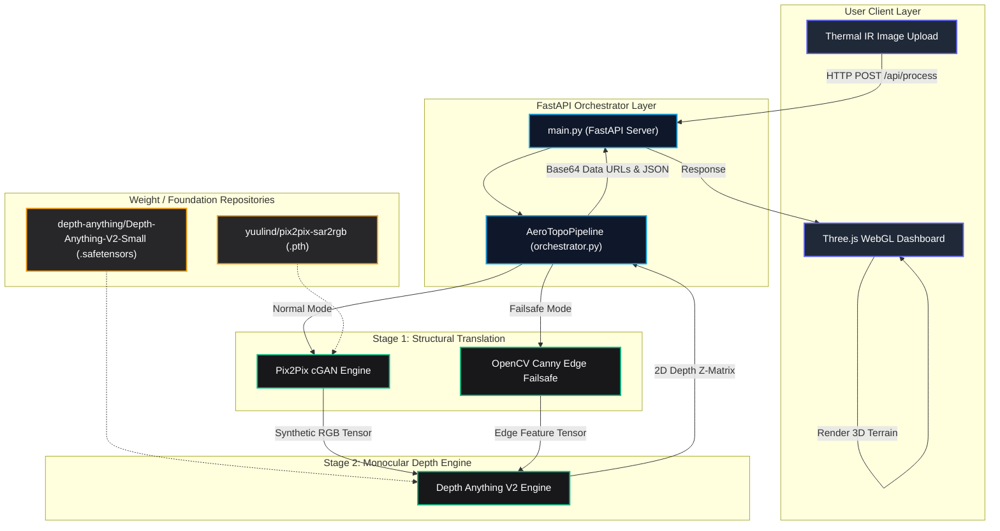

<div align="center">

# AERO-TOPO
### *Real-Time Thermal Infrared to 3D Topographical Reconstruction Engine*

[](https://www.python.org/)
[](https://pytorch.org/)
[](https://fastapi.tiangolo.com/)
[](https://threejs.org/)
[](https://huggingface.co/)
[](LICENSE)

<p align="center">
  <b>Transform zero-visibility, 2D single-channel thermal IR drone footage into high-fidelity, interactive 3D topographical meshes in real-time.</b>
</p>

[Key Features](#key-features) •
[Architecture](#system-architecture) •
[Pipeline Flow](#pipeline-data-flow) •
[Mathematical Foundations](#mathematical-foundations) •
[Quickstart](#quickstart--installation) •
[API Reference](#api-reference)

---

</div>

## Overview

**Aero-Topo** is a multi-node AI pipeline built for aerial reconnaissance, search & rescue, defense, and planetary survey applications. It solves the fundamental limitation of thermal sensors—lack of RGB texture and depth perception—by combining **Generative AI**, **Monocular Depth Foundation Models**, and **WebGL Hardware Acceleration**.

```
[ 2D Thermal IR Input ] ──► [ Pix2Pix cGAN ] ──► [ Depth Anything V2 ] ──► [ Three.js WebGL 3D Mesh ]
```

---

## Key Features

- **Stage 1: Generative Thermal-to-RGB Translation (Pix2Pix cGAN)**
  - U-Net Generator with skip connections and PatchGAN Discriminator.
  - Translates low-resolution single-channel thermal signatures into high-frequency RGB structural features.
- **Stage 2: Foundation Depth Estimation (Depth Anything V2)**
  - Monocular depth estimation via `Depth-Anything-V2-Small` to produce a dense $Z$-elevation matrix.
- **Stage 3: Interactive WebGL 3D Mesh Rendering (Three.js)**
  - Hardware-accelerated dynamic vertex displacement rendering right in the browser.
  - Controls for rotation, elevation scaling, wireframe toggles, and heightmap color mapping.
- **Deterministic Emergency Failsafe**
  - OpenCV Canny edge extraction backup trigger if GAN confidence degrades or fails.
- **High-Performance FastAPI Backend**
  - Asynchronous pipeline execution with base64 encoded data URLs for zero-latency client updates.

---

## System Architecture

The following diagram illustrates the complete module interaction from front-end user interaction down to model execution nodes:



---

## Pipeline Data Flow

```mermaid
sequenceDiagram
    autonumber
    actor User as Operator / Drone Stream
    participant Client as Three.js WebGL UI
    participant Server as FastAPI Orchestrator
    participant Stage1 as Pix2Pix cGAN
    participant Stage2 as Depth Anything V2
    participant Viz as 3D Projection Engine

    User->>Client: Upload Thermal IR Image (.png / .jpg)
    Client->>Server: POST /api/process (image_bytes, use_failsafe)
    
    rect rgb(30, 41, 59)
        note right of Server: Preprocessing & Resizing (256x256)
        alt Normal Mode
            Server->>Stage1: Translate Thermal IR -> Synthetic RGB
            Stage1-->>Server: Return RGB Structural Feature
        else Emergency Failsafe Active
            Server->>Stage1: OpenCV Canny Edge Extraction
            Stage1-->>Server: Return Edge Feature Map
        end
    end

    rect rgb(15, 23, 42)
        Server->>Stage2: Pass RGB Feature Tensor
        Stage2-->>Server: Generate Dense Relative Z-Depth Matrix
    end

    Server-->>Client: JSON Payload (Base64 Thermal, RGB, Depth Map)
    Client->>Viz: Construct Vertex Array & Apply Height Displacement
    Viz-->>User: Render Interactive Topographical 3D Mesh
```



---

## Mathematical Foundations

### 1. Conditional GAN (Pix2Pix) Objective
The Stage 1 Generator $G$ is trained to map a thermal input image $x$ to an RGB image $y$. The objective combines a conditional adversarial loss with an $L_1$ structural loss to prevent spatial hallucinations:

$$\mathcal{L}_{cGAN}(G, D) = \mathbb{E}_{x,y}\left[\log D(x,y)\right] + \mathbb{E}_{x,z}\left[\log \left(1 - D(x, G(x,z))\right)\right]$$

To preserve pixel-aligned physical boundaries, an additional $L_1$ distance constraint is applied:

$$\mathcal{L}_{L1}(G) = \mathbb{E}_{x,y,z}\left[ \| y - G(x,z) \|_1 \right]$$

The full optimization problem is formulated as:

$$G^* = \arg \min_G \max_D \mathcal{L}_{cGAN}(G, D) + \lambda \mathcal{L}_{L1}(G)$$

---

### 2. 2D-to-3D Pin-hole Camera Projection
To reconstruct 3D points $(X_w, Y_w, Z_w)$ from the 2D relative depth matrix $Z(u,v)$ output by **Depth Anything V2**, we apply inverse intrinsic camera projection:

$$X_w = \frac{(u - c_x) \cdot Z(u,v)}{f_x}$$

$$Y_w = \frac{(v - c_y) \cdot Z(u,v)}{f_y}$$

$$Z_w = Z(u,v)$$

Where:
- $(u, v)$ = Pixel coordinates in the 2D grid
- $(f_x, f_y)$ = Camera focal lengths
- $(c_x, c_y)$ = Principal point offset (optical center)
- $Z(u,v)$ = Predicted relative elevation matrix

---

## Project Structure

```
Aero-Topo/
├── main.py                   # FastAPI Application & API Server Entrypoint
├── project.txt               # Architecture Blueprint & Data Specs
├── requirements.txt          # Production Dependency Specification
├── models/
│   ├── cgan.py               # Pix2Pix cGAN Inference Engine
│   └── depth_engine.py       # Depth Anything V2 Foundation Model Interface
├── pipeline/
│   ├── orchestrator.py       # 3-Stage Pipeline Sequencer
│   └── failsafe.py           # OpenCV Canny Edge Extraction Engine
├── utils/
│   ├── preprocessing.py      # Image Normalization & Base64 Encoder
│   └── projection.py         # 3D Pin-hole Coordinate Projection Math
├── scripts/
│   └── download_models.py    # Auto-downloader for Hugging Face Weights
├── static/
│   ├── index.html            # Web Dashboard Application Shell
│   ├── style.css             # Dark Glassmorphism Design System
│   └── app.js                # Three.js 3D WebGL Rendering Controller
└── weights/                  # Model Weights (Git Ignored)
```

---

## Quickstart & Installation

### Prerequisites
- Python 3.11+
- PyTorch 2.0+ (CUDA recommended for real-time performance)

### 1. Clone & Setup Virtual Environment
```bash
git clone https://github.com/ROHITH-KUMAR-L/aero-topo.git
cd aero-topo

python -m venv venv
# On Windows:
venv\Scripts\activate
# On Linux/macOS:
source venv/bin/activate
```

### 2. Install Dependencies
```bash
pip install -r requirements.txt
```

### 3. Download Model Weights
```bash
python scripts/download_models.py
```

### 4. Launch the Web Application
```bash
python main.py
```
Open your browser at `http://localhost:8000` to access the live **Aero-Topo 3D Dashboard**.

---

### Docker Deployment

Alternatively, you can run the entire system inside a container using Docker or Docker Compose:

#### Option A: Docker Compose (Recommended)
```bash
docker-compose up --build -d
```

#### Option B: Standalone Docker Container
```bash
# Build the Docker image
docker build -t aero-topo:latest .

# Run the container with mounted weights volume
docker run -d \
  -p 8000:8000 \
  -v "$(pwd)/weights:/app/weights" \
  --name aero-topo-engine \
  aero-topo:latest
```

---


## API Reference

### `GET /api/health`
Returns pipeline initialization and hardware state.

**Sample Response:**
```json
{
  "status": "online",
  "pipeline_ready": true,
  "device": "cuda:0",
  "pix2pix_weights_loaded": true,
  "depth_weights_loaded": true
}
```

### `POST /api/process`
Uploads a thermal image and returns Base64 encoded outputs for 3D visualization.

- **Parameters**: 
  - `file`: Thermal IR Image (`.png`, `.jpg`, `.jpeg`, `.tiff`)
  - `use_failsafe`: `boolean` (optional, default `false`)

**Sample Response:**
```json
{
  "status": "success",
  "execution_time_sec": 0.342,
  "stage1_mode": "Pix2Pix SAR/Thermal-to-RGB",
  "stage2_mode": "Depth Anything V2 Small",
  "use_failsafe": false,
  "dimensions": { "width": 256, "height": 256 },
  "images": {
    "thermal_input": "data:image/png;base64,...",
    "rgb_output": "data:image/png;base64,...",
    "depth_map": "data:image/png;base64,..."
  }
}
```

---

## Datasets Supported

- **[Teledyne FLIR ADAS Dataset](https://www.flir.com/oem/adas/adas-dataset-form/)**: Paired Thermal/RGB frames across autonomous vehicle environments.
- **[KAIST Multispectral Dataset](https://www.kaggle.com/datasets)**: Academic standard paired thermal/visible terrain dataset.
- **Landsat-8/9 Satellite Imagery**: Multispectral satellite imagery for macro-topographical mapping.

---

## License

Distributed under the MIT License. See `LICENSE` for more details.